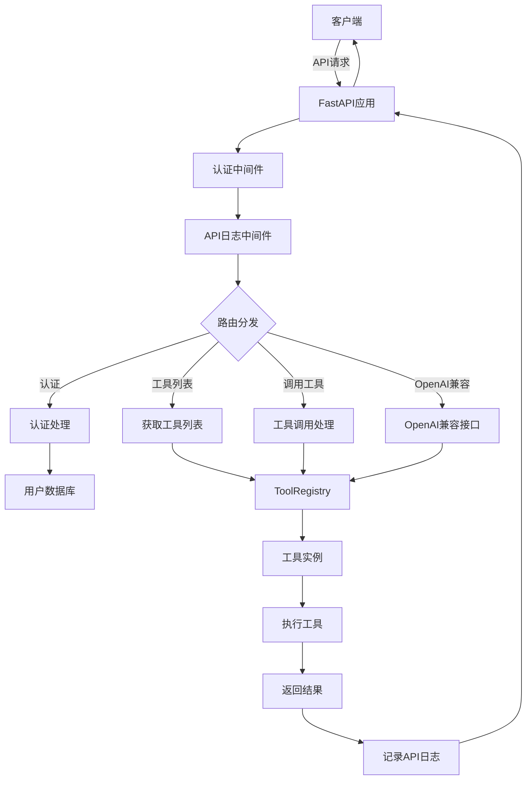

# Tools-AIGC

通用OpenAI兼容模型的function call工具集合调用服务，支持各种工具的内部代码实现和符合OpenAPI规范的外部服务调用。

## 项目简介

Tools-AIGC是一个基于FastAPI的服务，旨在提供统一的工具调用接口，使AI模型（如OpenAI的GPT系列）能够通过function calling功能调用各种工具和服务。主要特点包括：

- 提供统一的工具注册和调用机制
- 支持OpenAI兼容的function calling接口
- 可扩展的工具实现架构
- 自动生成工具参数模式
- 内置多种常用工具
- PostgreSQL数据库存储和ORM支持
- API调用日志记录
- JWT认证和路由白名单

## 目录结构

```
tools-aigc/
├── app/                    # 应用主目录
│   ├── api/                # API路由
│   │   └── endpoints/      # API端点
│   ├── auth/               # 认证模块
│   ├── core/               # 核心配置
│   ├── db/                 # 数据库模块
│   │   └── models/         # 数据库模型
│   ├── middleware/         # 中间件
│   ├── schemas/            # 数据模型
│   └── tools/              # 工具实现
├── migrations/             # 数据库迁移
├── tests/                  # 测试代码
├── examples/               # 示例代码
├── .env                    # 环境变量
├── .env.example            # 环境变量示例
├── alembic.ini             # Alembic配置
├── main.py                 # 应用入口
├── pyproject.toml          # 项目配置
└── requirements.txt        # 依赖项
```

## 功能模块

### 核心模块

- **工具基类 (BaseTool)**: 所有工具的基类，提供统一的接口和功能
- **工具注册表 (ToolRegistry)**: 管理所有已注册的工具
- **配置管理 (Settings)**: 管理应用配置和环境变量
- **数据库 (DB)**: PostgreSQL数据库连接和ORM模型
- **认证 (Auth)**: JWT认证和用户管理
- **中间件 (Middleware)**: API日志记录和认证中间件

### 内置工具

- **Echo工具**: 简单的回显工具，用于测试
- **天气查询工具**: 查询指定城市的天气信息
- **HTTP请求工具**: 发送HTTP请求并获取响应

## 安装与运行

### 环境要求

- Python 3.13+
- PostgreSQL 12+
- uv 包管理器 (推荐)

### 安装步骤

1. 克隆仓库

```bash
git clone https://github.com/yourusername/tools-aigc.git
cd tools-aigc
```

2. 安装 uv 包管理器 (如果尚未安装)

```bash
# 使用官方安装脚本
curl -sSf https://install.ultraviolet.rs | sh

# 或使用 pip 安装
pip install uv
```

3. 创建虚拟环境并安装依赖

```bash
# 创建虚拟环境并安装依赖 (二合一命令)
uv venv .venv
uv pip install -e .

# 或者分步执行
uv venv .venv
source .venv/bin/activate  # Linux/Mac
# 或
.venv\Scripts\activate  # Windows
uv pip install -e .
```

4. 配置环境变量

```bash
cp .env.example .env
# 编辑.env文件，设置必要的环境变量
```

5. 创建数据库

```bash
# 在PostgreSQL中创建数据库
createdb tools_aigc
```

6. 应用数据库迁移

```bash
uv pip install alembic
alembic upgrade head
```

7. 运行应用

```bash
uvicorn main:app --reload
```

应用将在 http://localhost:8000 运行，API文档可在 http://localhost:8000/api/docs 访问。

### 依赖管理

使用 uv 管理项目依赖：

```bash
# 安装新依赖
uv pip install package_name

# 更新依赖
uv pip install --upgrade package_name

# 从 pyproject.toml 生成 requirements.txt
uv pip export -o requirements.txt

# 查看已安装的依赖
uv pip list
```

## API接口

### 认证

```
POST /api/auth/login
```

使用用户名和密码登录，获取JWT令牌。

```
POST /api/auth/register
```

注册新用户。

```
GET /api/auth/me
```

获取当前用户信息。

### 工具列表

```
GET /api/tools/
```

获取所有可用工具的列表。

### 调用工具

```
POST /api/tools/{tool_name}
```

调用指定的工具，参数通过请求体传递。

### OpenAI兼容接口

```
POST /api/tools/openai/v1/chat/completions
```

OpenAI兼容的工具调用API，支持与OpenAI API相同的请求格式。

## 添加新工具

要添加新工具，只需创建一个继承自`BaseTool`的类，并实现`execute`方法：

```python
from app.tools.base import BaseTool, ToolRegistry, ToolResult

class MyTool(BaseTool):
    name = "my_tool"
    description = "我的自定义工具"

    async def execute(self, param1: str, param2: int = 0) -> ToolResult:
        # 实现工具逻辑
        result = f"处理参数: {param1}, {param2}"
        return ToolResult(success=True, data={"result": result})

# 注册工具
ToolRegistry.register(MyTool())
```

## 数据库迁移

使用Alembic管理数据库迁移：

```bash
# 创建新的迁移
alembic revision --autogenerate -m "描述迁移的内容"

# 应用迁移
alembic upgrade head

# 回滚迁移
alembic downgrade -1
```

## 测试

运行测试：

```bash
pytest
```

## 流程图



## 许可证

[MIT License](LICENSE)

## 更新日志

### [0.2.0] - 2025-03-16
* 添加PostgreSQL数据库支持
* 添加ORM模型和数据库迁移
* 添加API调用日志记录中间件
* 添加JWT认证和路由白名单
* 添加用户管理功能

### [0.1.0] - 2025-03-16
* 初始版本发布
* 实现基本工具调用框架
* 添加Echo、天气和HTTP请求工具
* 支持OpenAI兼容的function calling接口
