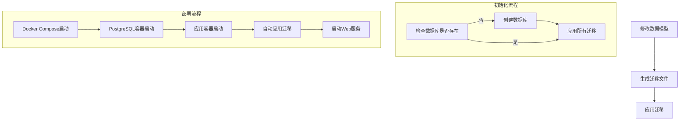
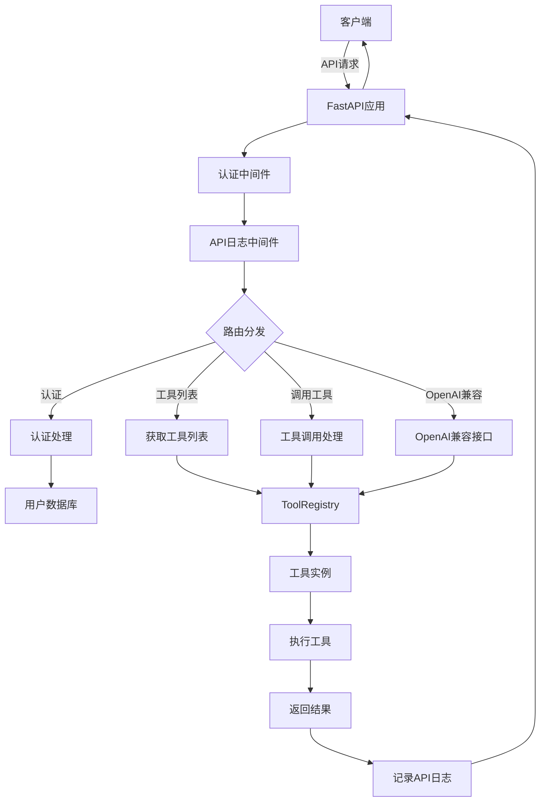

# Tools-AIGC

通用OpenAI兼容模型的function call工具集合调用服务，支持各种工具的内部代码实现和符合OpenAPI规范的外部服务调用。

## 项目简介

Tools-AIGC是一个基于FastAPI的服务，旨在提供统一的工具调用接口，使AI模型（如OpenAI的GPT系列）能够通过function calling功能调用各种工具和服务。主要特点包括：

- 提供统一的工具注册和调用机制
- 支持OpenAI兼容的function calling接口
- 可扩展的工具实现架构
- 自动生成工具参数模式
- 内置多种常用工具
- 支持工具调用缓存得以提高性能
- 会话级工具权限管理与多轮对话支持
- 多种输出格式支持（JSON、Markdown、Text、HTML）
- PostgreSQL数据库存储和ORM支持
- API调用日志记录
- JWT认证和路由白名单

## 目录结构

```
tools-aigc/
├── app/                    # 应用主目录
│   ├── api/                # API路由
│   │   └── endpoints/      # API端点
│   ├── auth/               # 认证模块
│   ├── core/               # 核心模块
│   │   ├── cache.py        # 工具调用缓存
│   │   ├── config.py       # 应用配置
│   │   ├── formatter.py    # 结果格式化
│   │   └── session.py      # 会话管理
│   ├── db/                 # 数据库模块
│   │   └── models/         # 数据库模型
│   ├── middleware/         # 中间件
│   ├── schemas/            # 数据模型
│   └── tools/              # 工具实现
├── migrations/             # 数据库迁移
├── tests/                  # 测试代码
├── examples/               # 示例代码
├── .env                    # 环境变量
├── .env.example            # 环境变量示例
├── alembic.ini             # Alembic配置
├── main.py                 # 应用入口
├── pyproject.toml          # 项目配置
└── requirements.txt        # 依赖项
```

## 功能模块

### 核心模块

- **工具基类 (BaseTool)**: 所有工具的基类，提供统一的接口和功能
- **工具注册表 (ToolRegistry)**: 管理所有已注册的工具
- **配置管理 (Settings)**: 管理应用配置和环境变量
- **工具调用缓存 (ToolCallCache)**: 缓存工具调用结果，提高性能并减少重复调用
- **会话管理 (SessionManager)**: 管理用户会话和工具权限
- **结果格式化 (ToolResultFormatter)**: 将工具调用结果格式化为指定输出格式
- **数据库 (DB)**: PostgreSQL数据库连接和ORM模型
- **认证 (Auth)**: JWT认证和用户管理
- **中间件 (Middleware)**: API日志记录和认证中间件

### 工具调用增强功能

- **工具调用缓存**: 基于内存的LRU缓存，支持TTL和容量限制
- **会话级工具权限**: 重使用会话ID限制可用工具，增强安全性
- **多格式输出**: 支持JSON、Markdown、纯文本和HTML格式
- **多轮对话支持**: 保持会话上下文，跟踪对话历史

### 内置工具

- **Echo工具**: 简单的回显工具，用于测试
- **天气查询工具**: 查询指定城市的天气信息
- **HTTP请求工具**: 发送HTTP请求并获取响应

## 工具调用增强功能

本项目实现了以下工具调用增强功能，提升了工具调用的灵活性和性能：

### 1. 工具调用缓存

- 基于内存的LRU缓存机制
- 支持TTL（存活时间）和最大缓存容量设置
- 仅缓存成功的工具调用结果

### 2. 会话级工具权限

- 基于会话ID的权限管理
- 每个会话可独立设置工具白名单
- 支持全局与特定会话的工具权限管理

### 3. 工具调用结果格式化

- 支持多种输出格式：JSON、Markdown、纯文本和HTML
- 自动转换不同数据类型的展示格式
- 通过HTTP头部定制输出格式

### 4. 多轮对话支持

- 会话跨请求的状态保持
- 自动维护对话历史与工具调用记录
- 通过会话ID保持上下文的连续性

### 使用方式

您可以通过以下方式使用增强功能：

- **会话管理**: 在请求头部添加 `X-Session-Id: <您的会话ID>`
- **格式化输出**: 在请求头部添加 `X-Output-Format: <json|markdown|text|html>`

### 详细示例与文档

- 完整示例代码：[工具调用增强功能示例](./examples/enhanced_tool_calls_example.py)
- 架构设计文档：[架构流程图](./docs/architecture.md)

## 安装与运行

### 环境要求

- Python 3.13+
- PostgreSQL 15+
- uv 包管理器 (推荐)

### 安装步骤

1. 克隆仓库

```bash
git clone https://github.com/yourusername/tools-aigc.git
cd tools-aigc
```

2. 安装 uv 包管理器 (如果尚未安装)

```bash
# 使用官方安装脚本
curl -sSf https://install.ultraviolet.rs | sh

# 或使用 pip 安装
pip install uv
```

3. 创建虚拟环境并安装依赖

```bash
# 创建虚拟环境并安装依赖 (二合一命令)
uv venv .venv
uv pip install -e .

# 或者分步执行
uv venv .venv
source .venv/bin/activate  # Linux/Mac
# 或
.venv\Scripts\activate  # Windows
uv pip install -e .
```

4. 配置环境变量

```bash
cp .env.example .env
# 编辑.env文件，设置必要的环境变量
```

5. 创建数据库

```bash
# 在PostgreSQL中创建数据库
createdb tools_aigc
```

6. 应用数据库迁移

```bash
uv pip install alembic
alembic upgrade head
```

7. 运行应用

```bash
uvicorn main:app --reload
```

应用将在 http://localhost:8000 运行，API文档可在 http://localhost:8000/api/docs 访问。

### 依赖管理

使用 uv 管理项目依赖：

```bash
# 安装新依赖
uv pip install package_name

# 更新依赖
uv pip install --upgrade package_name

# 从 pyproject.toml 生成 requirements.txt
uv pip export -o requirements.txt

# 查看已安装的依赖
uv pip list
```

## API接口

### 认证

```
POST /api/auth/login
```

使用用户名和密码登录，获取JWT令牌。

```
POST /api/auth/register
```

注册新用户。

```
GET /api/auth/me
```

获取当前用户信息。

### 工具列表

```
GET /api/tools/
```

获取所有可用工具的列表。

### 调用工具

```
POST /api/tools/{tool_name}
```

调用指定的工具，参数通过请求体传递。

### OpenAI兼容接口

```
POST /api/tools/openai/v1/chat/completions
```

OpenAI兼容的工具调用API，支持与OpenAI API相同的请求格式。

## 添加新工具

要添加新工具，只需创建一个继承自`BaseTool`的类，并实现`execute`方法：

```python
from app.tools.base import BaseTool, ToolRegistry, ToolResult

class MyTool(BaseTool):
    name = "my_tool"
    description = "我的自定义工具"

    async def execute(self, param1: str, param2: int = 0) -> ToolResult:
        # 实现工具逻辑
        result = f"处理参数: {param1}, {param2}"
        return ToolResult(success=True, data={"result": result})

# 注册工具
ToolRegistry.register(MyTool())
```

## 数据库迁移与初始化

### 本地开发环境

使用 uv 和 Alembic 管理数据库迁移：

```bash
# 创建迁移版本目录（如果不存在）
mkdir -p migrations/versions

# 创建新的迁移
uv run -m alembic revision --autogenerate -m "描述迁移的内容"

# 应用迁移
uv run -m alembic upgrade head

# 回滚迁移
uv run -m alembic downgrade -1

# 使用初始化脚本（自动创建数据库并应用迁移）
chmod +x scripts/init_db.sh
./scripts/init_db.sh
```

### Docker 环境

使用 Docker Compose 可以自动完成数据库的创建和迁移：

```bash
# 启动所有服务（数据库和应用）
docker-compose up -d

# 仅启动数据库
docker-compose up -d db

# 查看应用日志
docker-compose logs -f app
```

## Docker 部署

项目提供了完整的 Docker 支持，可以轻松部署到任何支持 Docker 的环境。

### 环境配置

项目提供了开发和生产环境的两种 Docker 配置：

- `Dockerfile.dev`：开发环境，使用 uv 包管理器
- `Dockerfile.prod`：生产环境，使用标准 pip 安装

环境变量配置使用统一的 `.env` 文件：

```bash
# 复制模板文件
cp .env.example .env

# 编辑自定义配置
vim .env
```

注意：`.env.example` 文件包含了本地开发和 Docker 环境的所有配置项，并提供了注释说明。

### 构建和运行

```bash
# 使用生产环境配置构建镜像
docker build -t tools-aigc -f Dockerfile.prod .

# 使用开发环境配置构建镜像
docker build -t tools-aigc-dev -f Dockerfile.dev .

# 运行容器
docker run -p 8000:8000 --env-file .env tools-aigc
```

### 使用 Docker Compose

```bash
# 启动所有服务
docker-compose up -d

# 切换到开发环境配置
DOCKERFILE=Dockerfile.dev docker-compose up -d

# 停止所有服务
docker-compose down

# 重建并启动服务
docker-compose up -d --build

# 查看应用日志
docker-compose logs -f app
```

### 数据库初始化流程



## 测试

运行测试：

```bash
pytest
```

## 流程图



## 许可证

[MIT License](LICENSE)

## 更新日志

### [0.2.0] - 2025-03-16
* 添加PostgreSQL数据库支持
* 添加ORM模型和数据库迁移
* 添加API调用日志记录中间件
* 添加JWT认证和路由白名单
* 添加用户管理功能

### [0.1.0] - 2025-03-16
* 初始版本发布
* 实现基本工具调用框架
* 添加Echo、天气和HTTP请求工具
* 支持OpenAI兼容的function calling接口
