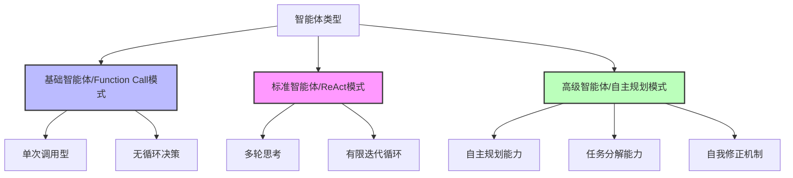
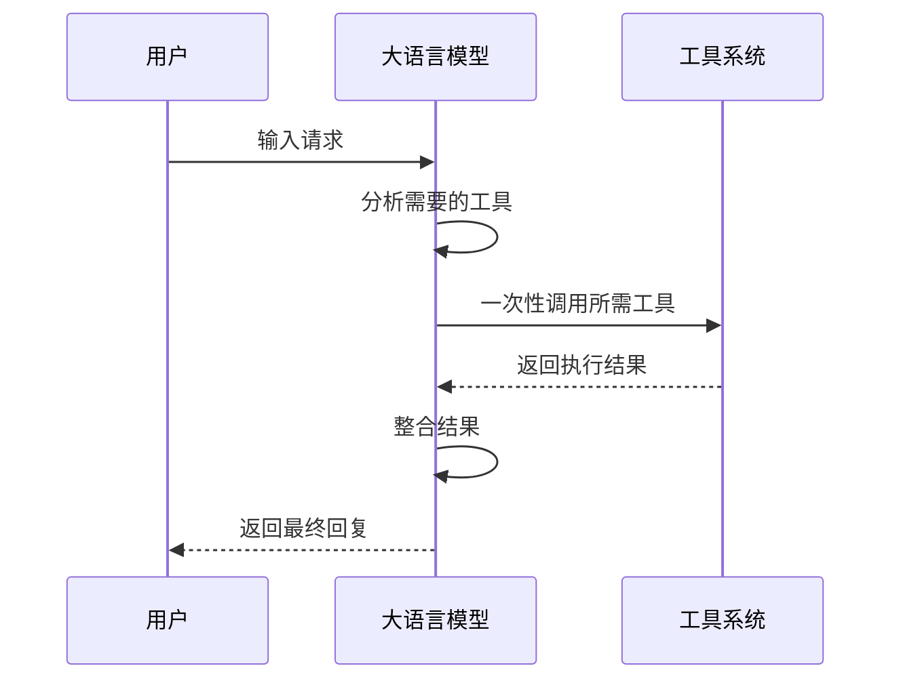
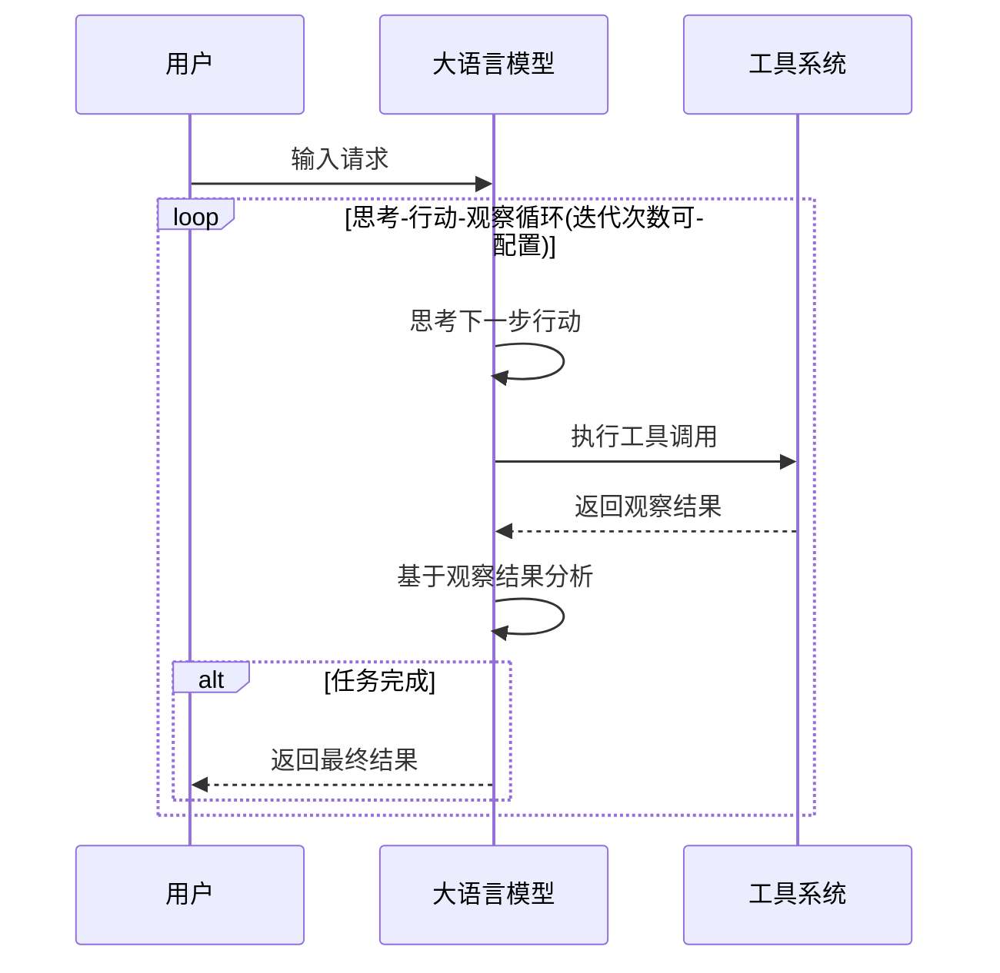
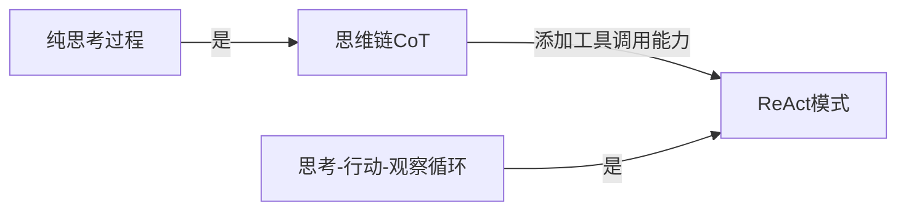
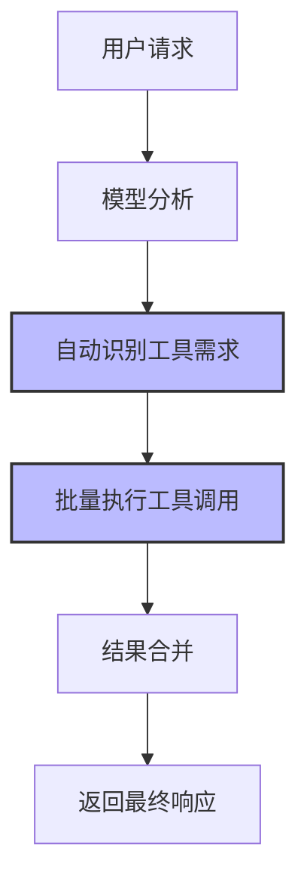
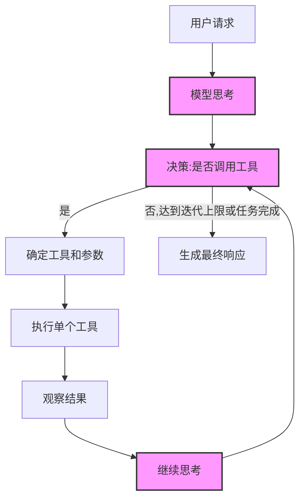
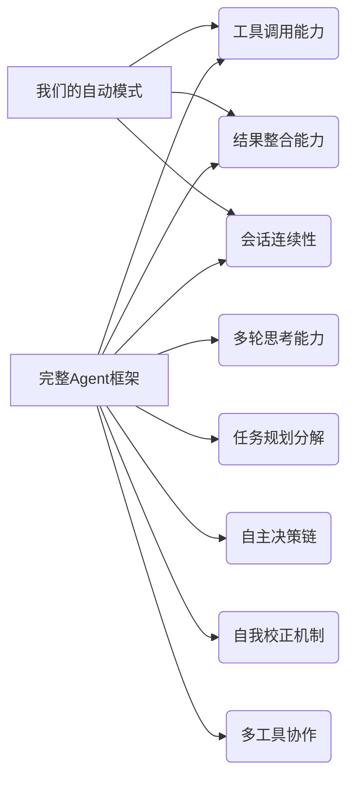

# 智能体模式与实现比较分析

## 1. 智能体概念与类型划分

智能体(Agent)是一种能够自主执行任务的AI系统，通过理解用户意图、规划行动步骤、调用工具和整合信息来完成复杂任务。根据实现方式和能力水平，智能体可分为不同层次。

### 1.1 智能体能力层级图



## 2. 主流智能体实现模式对比

### 2.1 Function Call模式（我们当前的实现）

这是一种简单直接的模式，大语言模型直接识别需要调用的工具，一次性执行后返回结果。

**特点**：
- 单步执行，无迭代循环
- 执行效率高，延迟低
- 适用于明确的、单一目标任务
- 实现复杂度低

**工作流程**：


### 2.2 ReAct模式（思考+行动模式）

ReAct (Reasoning + Acting) 模式结合了思维链 (Chain of Thought) 与工具调用能力，形成思考-行动-观察的循环过程。

**特点**：
- 多步迭代执行
- 每一步都有显式推理过程
- 能根据中间结果调整策略
- 适用于复杂、多步骤任务

**工作流程**：


## 3. CoT与ReAct的关系

Chain of Thought (CoT，思维链)是大语言模型的一种推理技术，而ReAct则是将其与工具调用相结合的扩展模式。



| 特性 | Chain of Thought (CoT) | ReAct模式 |
|------|----------------------|----------|
| 核心目标 | 通过显式推理步骤解决问题 | 将推理与工具使用交替进行 |
| 推理方式 | 纯思考过程，无外部交互 | 思考-行动-观察循环 |
| 能力范围 | 局限于模型已有知识范围 | 可访问外部工具和信息源 |
| 典型应用 | 数学解题、逻辑推理 | 信息搜索、任务执行、复杂问题解决 |

## 4. 我们的实现与框架Agent的对比

### 4.1 我们当前的自动模式实现



### 4.2 典型Agent框架实现(如Dify的ReAct模式)



## 5. 核心架构差异

| 特性 | 我们的自动模式实现 | 完整Agent框架(如Dify) |
|-----|------------|------------|
| **决策模型** | 单步决策：一次性分析并执行所有工具调用 | 多步循环决策：反复思考-执行-观察-思考 |
| **执行模式** | 并行批量执行模式 | ReAct模式（思考-行动-观察循环） |
| **控制流** | 固定工作流：分析→调用→合并结果 | 动态工作流：可根据中间结果调整后续步骤 |
| **状态管理** | 相对简单，主要基于会话历史 | 复杂状态管理，包含工作记忆和中间推理状态 |
| **迭代配置** | 无迭代能力 | 可配置最大迭代次数 |
| **思考可见性** | 隐式思考，不可见 | 显式思考，过程可追踪 |

## 6. 功能对比

我们的自动模式实现已经具备智能体的基本特性，但与完整的框架Agent相比还存在一些差距：



## 7. 进阶路径建议

要将当前的自动模式实现升级为完整的Agent框架，可以考虑以下步骤：

### 7.1 实现ReAct模式核心循环

```python
# 伪代码示例
def process_with_react(query, max_iterations=5):
    thoughts = []
    for iteration in range(max_iterations):
        # 思考阶段
        current_thought = llm.generate_thought(query, thoughts, previous_actions)
        thoughts.append(current_thought)
        
        # 行动阶段
        action = decide_action(current_thought)
        if action.type == "tool_call":
            result = execute_tool(action.tool, action.params)
        
        # 观察阶段
        observation = format_result(result)
        thoughts.append(f"观察到: {observation}")
        
        # 判断是否完成
        if should_finish(thoughts):
            break
    
    return generate_final_response(thoughts)
```

### 7.2 功能增强路径

1. **思考步骤显式化**：在工具执行前后增加模型思考步骤
2. **迭代控制机制**：实现可配置的最大迭代次数和智能停止条件
3. **状态追踪增强**：设计更完善的状态管理，跟踪思考链和执行历史
4. **任务规划能力**：让智能体能够分解复杂任务为多个子任务
5. **自我评估机制**：实现结果质量评估和自我修正能力

## 8. 结论

我们当前实现的自动模式工具调用系统是一个基础智能体的有效实现，它采用了Function Call模式，能够自动识别并执行工具调用。虽然缺少ReAct模式的多轮迭代思考能力，但在简单任务和查询场景下已经能够提供良好的用户体验和效率。

未来可以考虑逐步引入ReAct模式的核心特性，使系统具备更复杂的推理能力和任务处理能力，最终发展成为一个完整的智能体框架。
