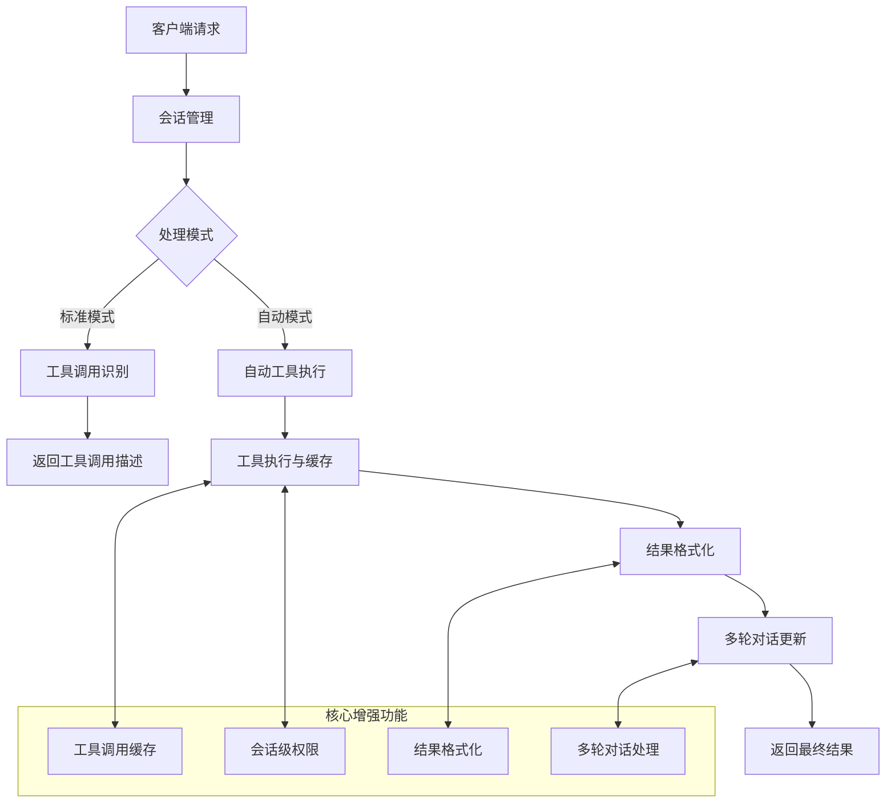
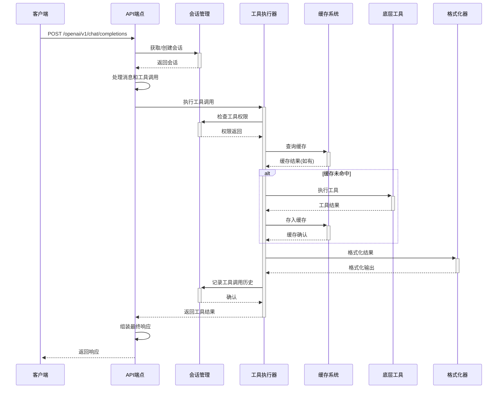
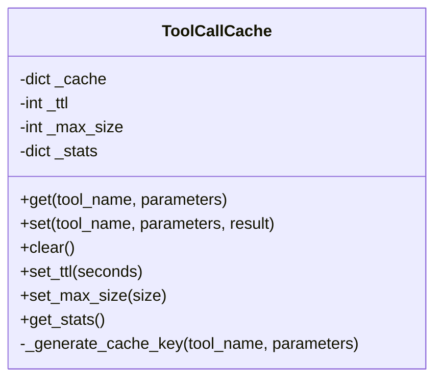
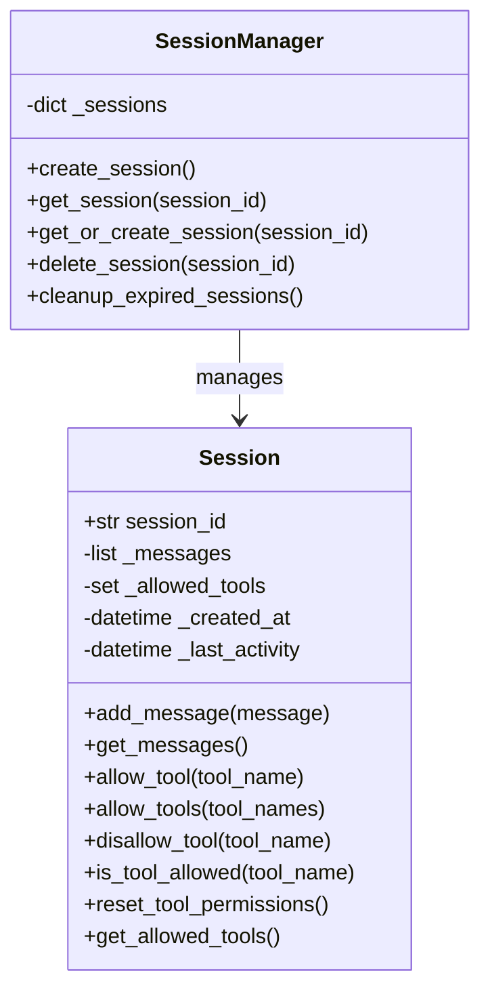
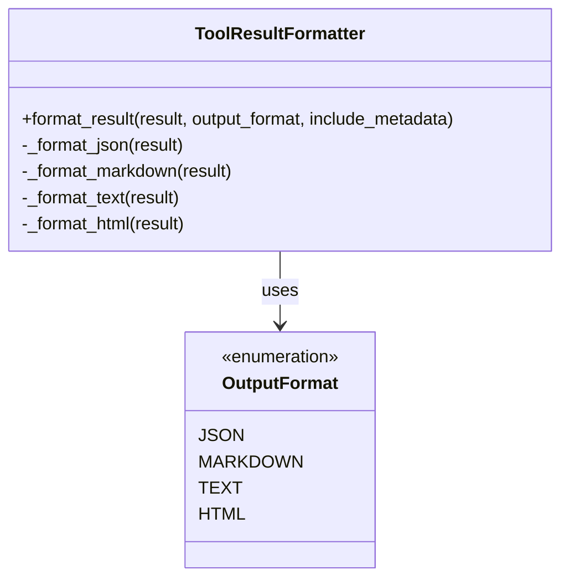
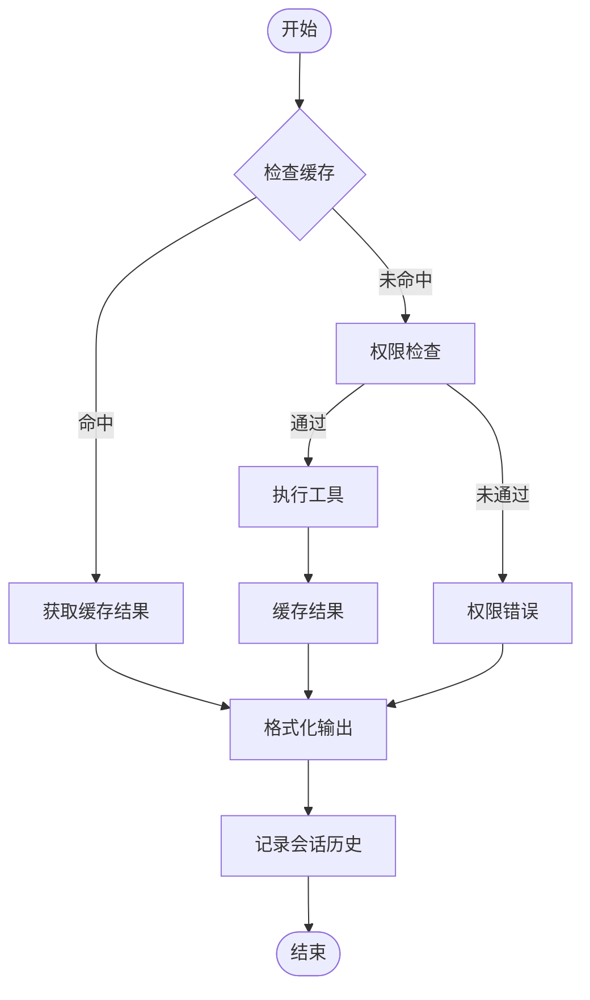
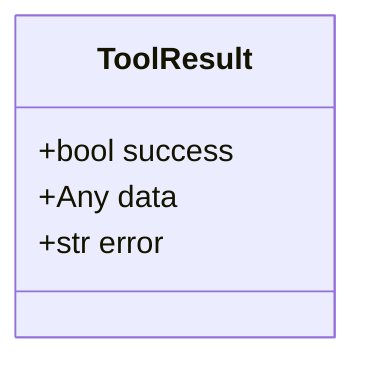
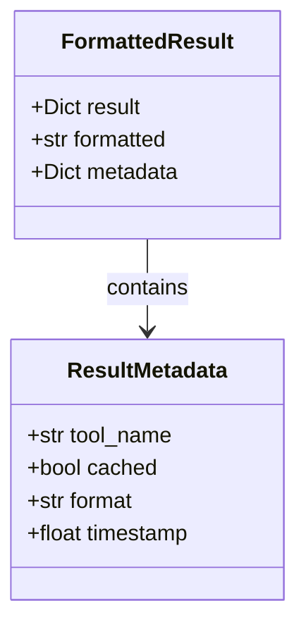

# Tools-AIGC 架构设计文档

本文档描述了Tools-AIGC项目的架构设计，包括核心组件、数据流程和交互模式。

## 工具调用增强功能架构

下图展示了工具调用增强功能的整体架构，包括缓存、会话管理、格式化和多轮对话支持：

## 数据流程架构

下图展示了一个完整工具调用的数据流程，从客户端请求到最终响应的全过程：

## 核心组件结构

### 缓存系统 (ToolCallCache)

### 会话管理 (SessionManager)

### 格式化器 (ToolResultFormatter)

## 工具调用执行流程

下图展示了工具调用的详细执行流程：

## 数据模型

### 工具结果模型

### 格式化结果模型

