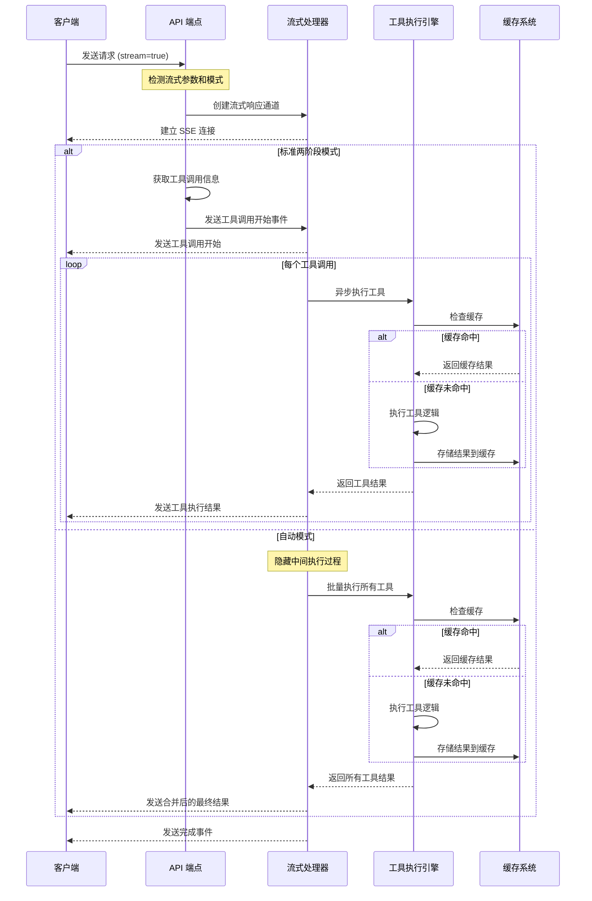
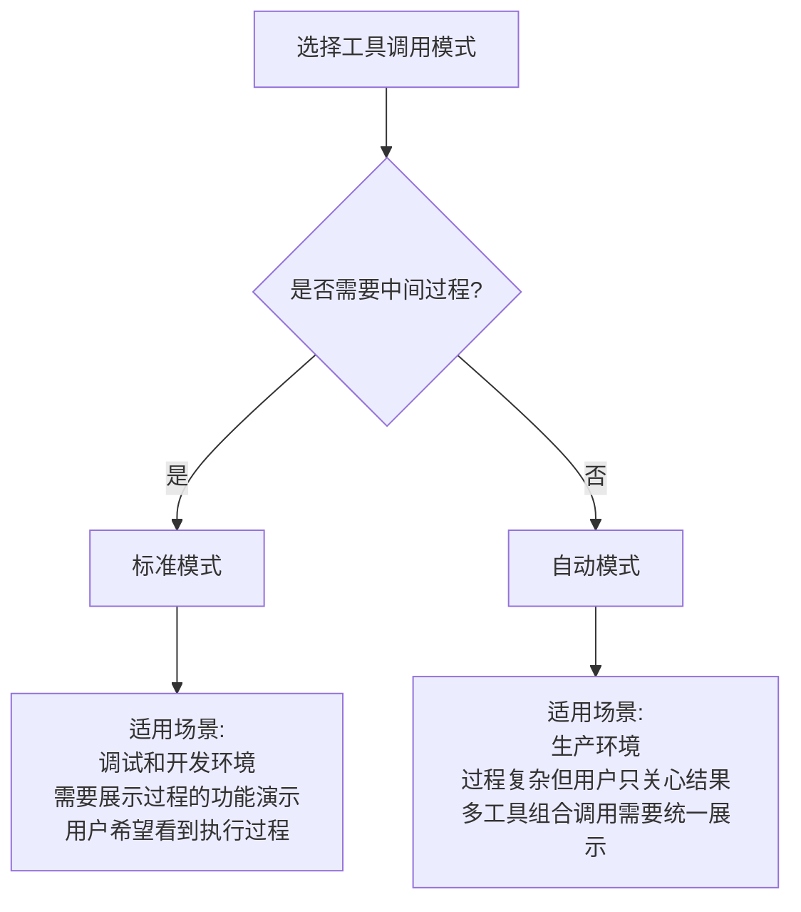

# 流式工具调用架构文档

本文档详细说明了 Tools-AIGC 中流式工具调用功能的设计与实现。

## 功能概述

流式工具调用允许客户端在工具执行过程中实时接收进度和结果，而不必等待全部工具执行完成后才返回结果。这提高了用户交互体验，尤其是在执行耗时较长的工具时。

流式响应采用 Server-Sent Events (SSE) 格式，与 OpenAI 的流式响应格式兼容，便于现有集成 OpenAI 的客户端无缝切换。

## 架构设计



## 组件说明

### 1. 流式响应处理器 (app/core/streaming.py)

负责管理 SSE 事件流的创建和发送，包括以下主要功能：

- 格式化 SSE 事件
- 创建符合 OpenAI 格式的增量选择对象
- 流式执行工具调用并发送结果
- 处理连接中断和错误情况

### 2. 工具调用执行流程

1. **请求接收**: API 端点检测 `stream` 参数和模式类型
2. **工具调用识别**: 分析消息，获取需要执行的工具调用
3. **流创建**: 建立 SSE 连接
4. **事件发送**: 
   - **标准模式**:
     - 发送工具调用开始事件
     - 逐个执行工具并发送中间结果
     - 发送完成事件
   - **自动模式**:
     - 隐藏中间过程，一次性执行所有工具
     - 将结果合并后发送给客户端
     - 发送完成事件
5. **错误处理**: 捕获和发送执行过程中的错误

### 3. 与其他系统的集成

流式工具调用功能与以下系统紧密集成：

- **会话管理**: 保持会话上下文，支持标准和自动模式下的多轮对话
- **缓存系统**: 提高重复工具调用的性能，在所有响应模式中生效
- **权限系统**: 确保工具调用的安全性，基于会话级别管控工具访问
- **格式化系统**: 支持多种输出格式（JSON、Markdown、Text、HTML）

## 客户端集成示例

详细的客户端集成示例见 `examples/stream_tool_calls_example.py`，包括：

1. 设置流式请求，支持标准和自动模式
2. 接收和解析 SSE 事件
3. 处理工具调用和结果
4. 错误处理和连接管理

```python
# 标准模式示例 - 显示所有中间步骤
{
    "model": "gpt-3.5-turbo",
    "messages": [...],
    "tools": [...],
    "tool_choice": {"type": "function", "function": {"name": "tool_name"}},
    "stream": True  # 启用流式响应
}

# 自动模式示例 - 只显示最终结果
{
    "model": "gpt-3.5-turbo",
    "messages": [...],
    "tools": [...],
    "tool_choice": "auto",  # 自动模式
    "stream": True  # 启用流式响应
}
```

## 模式选择与最佳实践

流式工具调用支持两种模式，各有不同的应用场景：



## 模式性能比较

| 模式 | 响应速度 | 用户体验 | 适用场景 | 网络流量 |
|--------|--------|--------|--------|--------|
| 标准模式 | 即时响应 | 完整过程透明 | 开发、测试、教学 | 较大 |
| 自动模式 | 较慢开始，但最终更快 | 简洁清晰 | 生产、运营、终端用户 | 较小 |

## 未来增强计划

1. 添加更细粒度的进度报告，例如百分比和当前步骤
2. 优化大型工具结果的流式传输，支持分片和阶段性返回
3. 实现客户端自动重连机制，防止长时间运行的工具连接断开
4. 支持多语言格式化的进度提示
5. 实现工具调用中途取消功能
