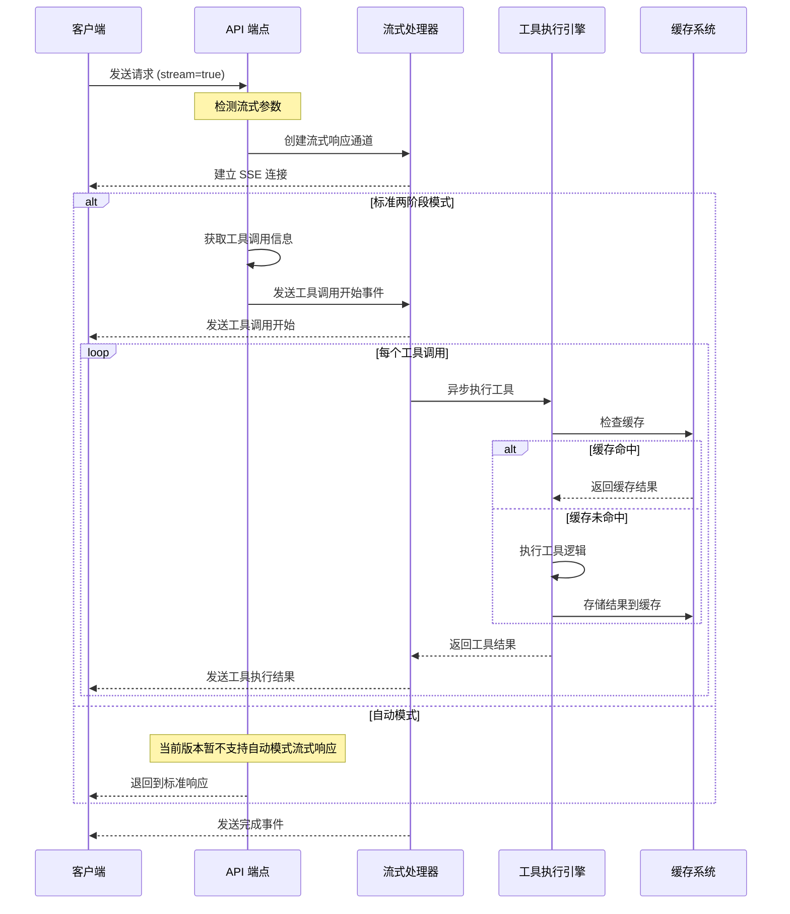

# 流式工具调用架构文档

本文档详细说明了 Tools-AIGC 中流式工具调用功能的设计与实现。

## 功能概述

流式工具调用允许客户端在工具执行过程中实时接收进度和结果，而不必等待全部工具执行完成后才返回结果。这提高了用户交互体验，尤其是在执行耗时较长的工具时。

流式响应采用 Server-Sent Events (SSE) 格式，与 OpenAI 的流式响应格式兼容，便于现有集成 OpenAI 的客户端无缝切换。

## 架构设计

## 组件说明

### 1. 流式响应处理器 (app/core/streaming.py)

负责管理 SSE 事件流的创建和发送，包括以下主要功能：

- 格式化 SSE 事件
- 创建符合 OpenAI 格式的增量选择对象
- 流式执行工具调用并发送结果
- 处理连接中断和错误情况

### 2. 工具调用执行流程

1. **请求接收**: API 端点检测 `stream` 参数
2. **工具调用识别**: 分析消息，获取需要执行的工具调用
3. **流创建**: 建立 SSE 连接
4. **事件发送**: 
   - 发送工具调用开始事件
   - 逐个执行工具并发送结果
   - 发送完成事件
5. **错误处理**: 捕获和发送执行过程中的错误

### 3. 与其他系统的集成

流式工具调用功能与以下系统紧密集成：

- **会话管理**: 保持会话上下文
- **缓存系统**: 提高重复工具调用的性能
- **权限系统**: 确保工具调用的安全性
- **格式化系统**: 支持多种输出格式

## 客户端集成示例

详细的客户端集成示例见 `examples/stream_tool_calls_example.py`，包括：

1. 设置流式请求
2. 接收和解析 SSE 事件
3. 处理工具调用和结果
4. 错误处理和连接管理

## 未来增强计划

1. 支持自动模式的流式响应
2. 添加更细粒度的进度报告
3. 优化大型工具结果的流式传输
4. 实现客户端重连机制
